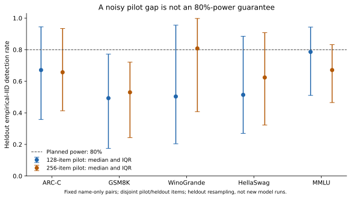

# eval-power

This checks whether a small, same-item LLM pilot can reliably plan a larger accuracy comparison.

**Question:** how many items do two models need, and how often does a pilot get that budget right?

This extends [Kotawala’s paired audit](https://arxiv.org/abs/2605.30315) and [Basile et al.’s planning toolkit](https://aclanthology.org/2026.lrec-1.353/) with disjoint-pilot calibration—not new power formulas. Data are tinyBenchmarks’ **selected 395-model, 2024 Open LLM Leaderboard population**, not current frontier models ([source and licenses](data/manifest.json)).

[stats.py](src/eval_power/stats.py) contains paired, unpaired and clustered errors plus an item-count planner. [analysis.py](src/eval_power/analysis.py) fits small pilots, then checks their predictions using heldout item subsampling and exact McNemar tests.

**Result:** 128-item observed-gap plans targeting 80% power delivered **49.3–78.6% median heldout detection** ([calibration](results/calibration.csv)). This measures a known pilot-planning problem for LLM comparisons—not a new statistical discovery.

## Planning budgets and leaderboard noise

Rounded medians, **items/model (paired / unpaired)**: prespecified differences, empirical non-identical adjacent-pair variances, two-sided α = 0.05, 80% Gaussian power—not simultaneous leaderboard budgets. Interquartile ranges and more differences: [lookup.csv](results/lookup.csv).

| Benchmark | 1 percentage point | 2 percentage points | Adjacent gaps not distinguishable |
|---|---:|---:|---:|
| ARC-Challenge | 13.0k / 37.3k | 3.3k / 9.3k | 99.7% |
| GSM8K | 15.1k / 24.4k | 3.8k / 6.1k | 100% |
| WinoGrande | 13.9k / 28.0k | 3.5k / 7.0k | 100% |
| HellaSwag | 5.7k / 22.4k | 1.4k / 5.6k | 98.7% |
| MMLU | 17.0k / 37.6k | 4.3k / 9.4k | 99.7% |

Exact McNemar tests use Holm over **all 77,815 pairs/benchmark**, before selecting 394 adjacencies; rankings use item-weighted accuracy and label-sorted ties ([audit](results/audit.csv), [tests](results/all_pair_tests.npz)). Not distinguishable does **not** mean equal.

Without correction, only **1–12 of 394** adjacent pairs differ at α = 0.05 (ARC 1, GSM8K 1, WinoGrande 1, HellaSwag 12, MMLU 11). Exact score ties (same order): 171, 93, 220, 56, 13; trivially indistinguishable ([audit](results/audit.csv)).

Measured adjacent-item correlations were 0.34–0.73; pairing reduced median standard errors by 19–48%. For MMLU, clustering its 57 subjects increased median adjacent SE by 1.60× and left no adjacent gap distinguishable ([audit](results/audit.csv)).

## How well do pilots predict power?

Pairs are selected by indices, not scores: 40 pairs per benchmark, five disjoint item splits, and 1,000 trials per point ([configuration](results/configuration.json)). Each pilot-gap plan targets 80%; the table reports its **median observed** detection under the empirical heldout IID distribution:

| Benchmark | Pilot: 128 items | Pilot: 256 items | 128-item plans below target* |
|---|---:|---:|---:|
| ARC-Challenge | 67.1% | 65.7% | 56.5% |
| GSM8K | 49.3% | 53.0% | 75.0% |
| WinoGrande | 50.4% | 80.8% | 60.1% |
| HellaSwag | 51.4% | 62.4% | 65.9% |
| MMLU | 78.6% | 67.1% | 48.5% |

*Among nonzero-gap, positive-variance plans: upper Monte Carlo 95% bounds below 80%; not future-population guarantees.*

At the smaller pilot size, power-curve mean absolute error was 10.0–25.4 percentage points versus 1.9–4.4 for a heldout-fitted normal reference ([calibration](results/calibration.csv)). Larger pilots did not uniformly improve the gap-based rule. Raw [curves](results/validation_curves.csv.gz) and [plans](results/pilot_plans.csv.gz) retain Monte Carlo intervals; without-replacement results describe only the fixed pool.

Noisy pilot effects producing underpowered follow-ups are established concerns: [Albers & Lakens 2018](https://doi.org/10.1016/j.jesp.2017.09.004) and [Kraemer et al. 2006](https://pubmed.ncbi.nlm.nih.gov/16651505/). The safer variance-based plan fixes the smallest meaningful difference beforehand and uses the pilot for variance, not the target effect; variance transfer still needs checking.



[Calibration curves](figures/pilot_calibration.svg) · [Minimum detectable differences](figures/minimum_difference.svg) · [Leaderboard noise](figures/leaderboard_noise.svg)

## Reproduce and plan

CPU-only, $0 paid compute; Ryzen AI 5 PRO 340, one numerical thread, Python 3.11 ([environment](results/environment.json)). Matrices are committed; the optional [importer](scripts/import_data.py) pins source hashes. Model inference was not run.

```sh
uv sync --locked
nice -n 19 env OPENBLAS_NUM_THREADS=1 OMP_NUM_THREADS=1 MKL_NUM_THREADS=1 uv run python scripts/analyze.py && uv run python scripts/figures.py
uv run eval-power --difference .01 --variance .2
```

CLI example. `--pilot pilot.npy` estimates paired/unpaired variance; choose the meaningful difference **before** evaluating, not the pilot gap. Zero-variance pilots are refused. Group labels report clustered SE, not IID item-budget extrapolation. [Tests](tests/) and [CI](.github/workflows/ci.yml) check references and committed results.

## Limits and prior work

- These are selected historical models, often related fine-tunes or merges—not independent families.
- Original document IDs and evaluation revisions are absent. MMLU alignment inherits the exporter’s ordering assumption; it was not independently ID-audited.
- Empirical IID trials resample heldout scores; they are not newly answered questions or proof of future power. One response per item cannot measure decoding variability.
- Subject clustering assumes independently sampled subjects. Adding questions to existing subjects is not adding independent subjects.
- Lookup medians hide pair variation; observed identical vectors do not justify a zero-item budget.

Foundations: [Miller 2024](https://arxiv.org/abs/2411.00640), [Madaan et al. 2024](https://arxiv.org/abs/2406.10229), [Polo et al. 2024](https://proceedings.mlr.press/v235/maia-polo24a.html), [Card et al. 2020](https://aclanthology.org/2020.emnlp-main.745/), and [Neuhof & Benjamini 2026](https://arxiv.org/abs/2607.16259). [Prior-work notes](docs/PRIOR_WORK.md) explain the overlap and extension. Code is MIT; data terms are recorded separately.

Written with AI coding assistance.
