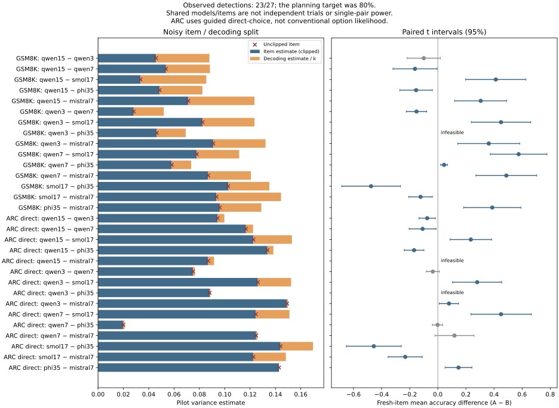
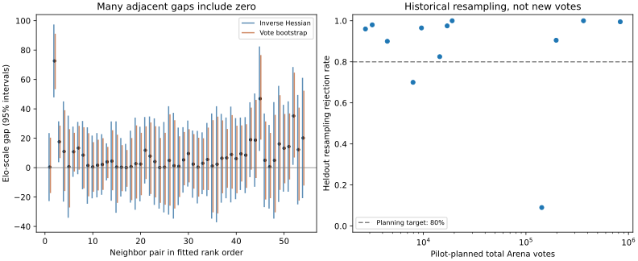

# eval-power

I generated **13,830 answers from six small language models**, committed my sample-size plans before collecting fresh-item answers, and detected differences in **23 of 27 planned comparisons**. That is an observed detection fraction, **not proof of 80% power**. My repeated-decoding pilot also found a much larger decoding-noise share on GSM8K than on guided-choice ARC.

[Try my power calculator](https://mottopanikeiku.github.io/eval-power/) · [Prior work and citations](docs/PRIOR_WORK.md)

## What the new experiment says

Each model answered the same 64 pilot questions per benchmark once greedily and five times at temperature 0.7. I used Qwen2.5 1.5B, 3B and 7B, SmolLM2 1.7B, Phi-3.5-mini and Mistral-7B-v0.3: six checkpoints across four families, with pinned revisions and licenses in the [protocol](results/prospective/protocol.json). Qwen's 3B checkpoint has a noncommercial research license.

| Benchmark / decoding task | Median estimated decoding share at k=5 | Median questions for a hypothetical 1-point gap, k=1 → k=5 | Fresh detections |
|---|---:|---:|---:|
| GSM8K, free-form numeric answers | 33.2% | 20,147 → 8,743 | 13 / 14 |
| ARC-Challenge, guided direct choice | 4.6% | 11,371 → 10,864 | 10 / 13 |

[Every pair, variance estimate, question count, p-value and interval](results/prospective/summary.json) is available. The one-point counts assume a two-sided 5% test and an 80% normal-approximation target; they are hypothetical budgets, not tested one-point effects. Here k=1 means one stochastic draw, **not greedy decoding**. Fewer questions with k=5 does not imply fewer generated answers or lower GPU cost.



I estimate

\[
\operatorname{Var}(\bar Y_A-\bar Y_B)=\sigma^2_{\mathrm{item}}+\sigma^2_{\mathrm{decode}}/k.
\]

I estimate decoding variance within questions, subtract it from the observed variance of item means, and retain the unclipped item estimate before applying a zero floor for planning. Neither component is perfectly identified by a 64-question pilot.

I published the [exact plan commit](https://github.com/mottopanikeiku/eval-power/commit/bbbae30a37a3b80ca43af6e8e23444e3892bdb78) before confirmation. Each feasible pair received its planned 16–264 new questions and a paired t-test on five-answer item means. Those answers were reused across comparisons sharing a model. I collected **9,222 confirmation answers**, separate from the pilot. Three pairs needed more than my declared 512-question collection limit and were not run: GSM8K Qwen3–Phi required 870; ARC Qwen1.5–Mistral required 1,503 and Qwen3–Phi required 881. I did not cap their plans and call them 80%-power tests.

### What I changed before confirmation

This was a precommitted confirmation, **not a protocol registered before seeing any pilot**. My initial GSM grader demanded `####`; relaxing numeric extraction changed Qwen1.5's score from 15.9% to 65.9% on the same original sampled texts. Phi still truncated 18.1% of unconstrained ARC samples at 1,024 tokens. I therefore changed **all six models** to native constrained `Answer: <label>` generation, rather than claiming Phi became better or its stop tokens were broken. This is **not conventional ARC option-likelihood evaluation**.

I also found that vLLM's child-seed offset caused neighboring questions to reuse 426 of 3,840 requested streams in the initial pilot. I repaired the stride and recollected both primary pilots: **3,840 distinct stochastic seeds, zero reused**. I retained [all earlier pilots and the complete revision comparison](results/prospective/pilot_revision.json). Strict-format rescoring of the primary confirmation detects 22/27 differences; those sample sizes were not planned for that secondary metric.

## Human preferences: adjacent ranks are usually unresolved

I also analyzed a [pinned, Apache-2.0 historical Arena vote release](data/arena_manifest.json), retaining only model names and outcome counts—not conversations or user IDs. After an exposure filter, 54,985 votes cover 55 models. Only **4/54 adjacent contrasts** exclude zero under either pointwise Wald or bootstrap 95% intervals. Their median fitted 80%-power requirement is **3.30 million total network votes**, not direct-match votes.



For 12 score-independent planning pairs, 200 resamples each from disjoint held-out vote counts produced a median rejection fraction of 96.25%, ranging from 9% to 100%. The llama-2-7b-chat / llama2-70b-steerlm-chat plan required 142,611 network votes yet rejected in only 18/200 resamples. [Results and assumptions](results/arena/summary.json) make the planning failures visible. These are historical resamples, **not newly collected human votes or a current leaderboard**; selected adjacent intervals are neither simultaneous nor selection-adjusted.

## Reproduce and interpret

```bash
uv sync --locked
uv run python scripts/prospective_analysis.py
uv run python scripts/arena.py --bootstrap 500 --trials 200
uv run python scripts/check_results.py
uv run pytest
```

These commands analyze committed outputs without model downloads. The [collector](modal_app.py) records prompts' hashes, answers, seeds, revisions and generation settings. All cloud calls—including failed setup and diagnostic reruns—cost **at most $3.02** by my conservative [booking-based estimate](results/prospective/costs.json), not an invoice. I make no local timing claim.

My limits: public benchmark contamination is possible; these are small instruction-tuned models; finite pilots can misestimate effects and variance; overlapping comparisons have no multiplicity correction; and Arena's IID, transitive Bradley–Terry model cannot recover unavailable user/prompt clustering. My [earlier single-answer analysis](results/calibration.csv) and calculator remain separate from this new experiment.

Written with AI coding assistance.
